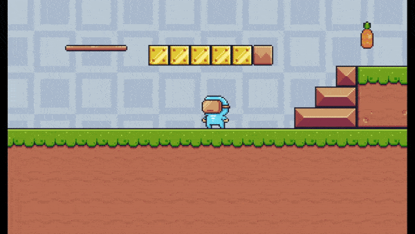

# secomp2023_plataformer

A plataformer demo project to 2023SECOMP game dev basics course, The Computing Week(SECOMP) of Federal University of Alagoas(UFAL).

Topics taught:

- Characters and Inputs
- Componentization
- Map Creation with Tilemap
- Coyote Jump and Game Feel

## Demo gameplay

### Used assets:

- https://pixelfrog-assets.itch.io/pixel-adventure-1
